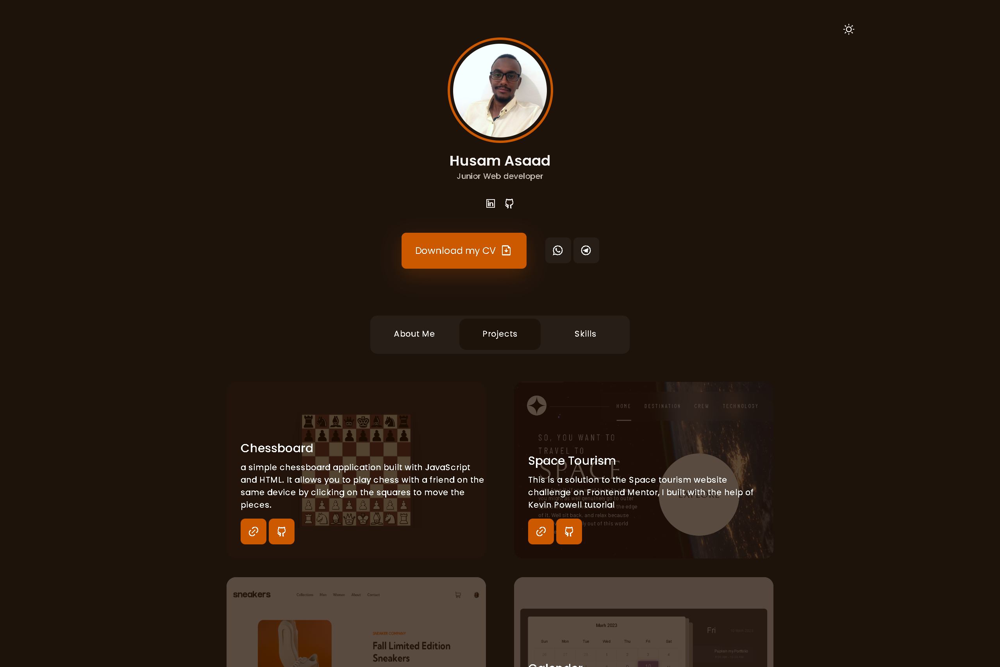

# My Personal Portfolio Website

This is my personal portfolio website that showcases my skills, projects and contact information. I built it using HTML, CSS and JavaScript to create a responsive and interactive layout. My goal was to create a simple yet elegant website that reflects my personality and passion for web development.

### Screenshot

### Links

- [Live Site URL](....)

## My process

### Built with

- Semantic HTML5 markup
- CSS custom properties
- Flexbox
- Mobile-first workflow
- Vannila JavaScript

## Author

- github Profile - [Husam Asaad](https://github.com/husamasaad)

## Aknowledgment

- Special thanks to [Bedimcode](https://www.youtube.com/watch?v=mq0xJxOTiYo), I built this project after watching his video.
